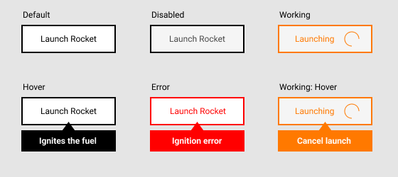

# Wayflyer FE Engineer Take Home Test

You have been tasked with building a re-usable button for the Wayflyer mission control dashboard.

The button needs to make a GET request to a mission control server to ignite the rocket fuel and launch the Wayflyer rocket ship.
However, if the rocket fuel takes too long to ignite then something is not right and the request should be abandoned. Also, launching rockets is scary, if the user gets cold feet they need to be able to abort a launch request before it completes.

Using `React` + `Typescript` & `Jest` *implement and test a button with the six states shown below*.

Ensure each of the requirements are met and and that each is covered by tests.

## Requirements

* It should make a network request to a URL passed as props
* It should show the “Working” state for the duration of the network request
* It should optionally timeout the network request after a max duration passed as props
  * Pro-tip: https://httpbin.org/delay/2 - accepts a GET and responds in 2 seconds
* It should show the error state after the max duration is exceeded and the network request is cancelled
* It should return to the default state after the network request completes if there is no timeout provided
* A second click of the button should abort a request that is in-flight and show the error state
* It should be possible to put the button into each state via props
* The tooltip should not show if the button is disabled
* The error state should not show if the button is disabled or working
* The tooltip should always show when in the error state

## None Functional Requirements

* Design your button API to be intuitive for other developers to use
* The button should be re-usable in different contexts
* The button should be well tested
* The button should be accessible

## Notes
* If possible implement the button styles using styled components.
* Try to follow the designs as closely as possible
* We expect your code to run in a browser and demonstrate the button behaviour
* We expect to be able to run `yarn test` and see the tests run green

**Bonus points** for code re-usability and/or using Storybook.

